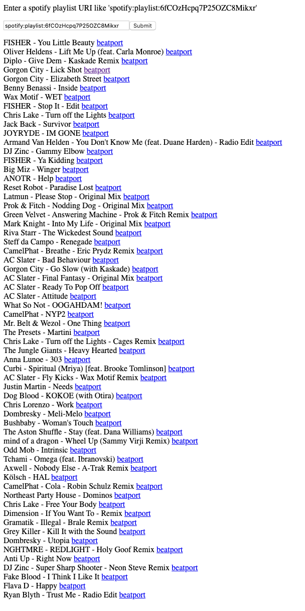

# Track lister

This "app" list out all the tracks from a Spotify playlist and also a clickable link to search for the song on Beatport. 

This was written by me so that I can explore music that I want to DJ, chuck them in a playlist and then easily bulk buy 
them from a online music vendor.  

## Usage

In order to run this example yourself, you'll need to:

1. Register an application at: https://developer.spotify.com/my-applications/
  - Use "http://localhost:8080/callback" as the redirect URI
2. Set the SPOTIFY_ID environment variable to the client ID you got in step 1.
3. Set the SPOTIFY_SECRET environment variable to the client secret from step 1.
4. Set the CALLBACK_URL environment variable to "http://localhost:8080/callback"

The app will on the first request to http://localhost:8080 will use an OAUTH kind of permission flow
from you to use your account for searching songs.

## Preview

